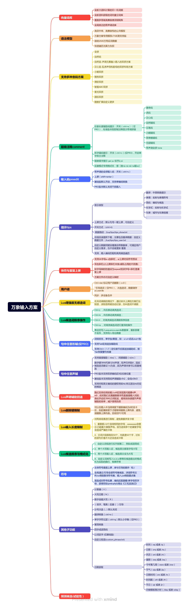

---

# 万象系列方案 [](https://deepwiki.com/amzxyz/rime_wanxiang)

---------------------

## 万象拼音——基于深度优化的词库和语法模型

[万象词库与万象语言模型](https://github.com/amzxyz/RIME-LMDG) 是一种带声调的词库，经过AI和大基数语料筛选、加频，结合语言模型获得更准确的整句输出。

### 优势

1. 在这里你能找到最为全面的拼音标注数据库，词库词语全部加音调。可应用于多种带声调输入方案，也可将声调作为注释，输入码位置显示，也可直接上屏，是唯一一个支持整句拼音串上屏的方案；
   
2. 长期死磕首选权重最优解、分词片段最优解，大量应用错位构词法，让语句行云流水，结合语法模型，维护词库与维护模型同时进行，形成完美搭配；

3. 在这里你能找到最为全面的反查数据库，现已支持到U17：支持两分、多分、笔画三种打法,在生僻字输入、反查的场景中发挥重要作用；

4. 在这里你能找到最为有趣的Lua扩展功能，如成对符号包裹首选、tips多类型扩展显示与上屏、手动实时排序以及无感造词不调频的新鲜用法；

5. 维护了来自圈内的6种辅助码，头部使用全拼编码，可以转化为任何双拼编码，辅助码有：墨奇码；鹤形；自然码；虎码首末；五笔前2；汉心码，因此，万象拼音支持拼音和辅助码任意两两组合

6. 万象总结下来，从里到外，是一场翻天覆地的巨变，所涉及之处无不要求做到最优、最精。 这是我们持续的追求！

**万象词库中的带声调拼音标注+词组构成+词频是整个万象项目的核心，是使用体验的基石，方案的其它功能皆可自定义，我希望使用者可以基于词库+转写的方式获得输入体验** [万象词库问题收集反馈表](https://docs.qq.com/smartsheet/DWHZsdnZZaGh5bWJI?viewId=vUQPXH&tab=BB08J2)

---------------------

**效果大赏**


---------------------

|版本差异|标准版|增强版|
|--- |  ----  | ---  |
|方案文件|wanxiang.schema.yaml|wanxiang_pro.schema.yaml|
|支持类型|全拼、任何双拼|只支持双拼|
|是否调频|默认开启|默认关闭|
|用户词记录|无差别自动记录，词库混乱|需手动造词``引导，词库可控|
|用户词位置|wanxiang.userdb|zc.userdb|
|辅助码|有基于声调的辅助|有7种辅助码可选，同时兼容声调辅助|
|简码|全拼开启基于转写的简码，双拼未开启|有携带部分数据但未配置(自己设置的才是自己的)|
|词库格式|你➩nǐ➩1000|你➩nǐ;re➩1000|

### 新手快速入门

不了解rime基础的可以参考友情链接，初步了解rime运行的些许特性：

[oh my rime](https://www.mintimate.cc/zh/guide/installRime.html) 

[rime参数配置](https://xishansnow.github.io/posts/41ac964d.html)

整个rime配置生态都是通的，里面有非常完整的使用方法，(诸如放到哪里、换个皮肤、什么是用户目录。。。)

**友情提示：** *如果你是第一次使用万象，可以不要用你过往经验来定义万象，按如下的步骤将万象跑起来后,体验一下万象的功能，然后学习一下万象的各项内容之后再考虑。*

#### ①快速运行：

1. 将方案文件置于用户目录中，直接部署，等待部署完成后，

2. 输入以下指令(斜杠引导)切换为对应的双拼/全拼，切换后按照提示重新部署，完成。  
3. 这样的指令能帮你一次性完成4个补丁文件的输入类型修改，运行逻辑：根目录无自定义文件则复制custom文件夹相关文件出来并修改为对应的输入方案，如果根目录存在则只修改输入方案，不进行复制，因此不会被覆盖。  
4. ios仓输入法，平台特殊，需要额外去：方案文件管理-使用键盘文件覆盖应用文件，才能完成文件变更，具体操作如下：
   - 仓设置首页 -> 输入方案设置 -> 点击右上角 "+" -> 方案下载 -> 下载一套万象输入法方案, 如: 万象拼音标准版
   - 仓设置首页 -> 体验输入法 (或者随便找一个可以唤起输入法的场景) - 长按键盘输入"/" (不要上划输入), 然后接想要的方案, 比如 "/flypy", 此时输入法会提示已切换至相应方案
   - 仓设置首页 -> 文件管理 -> 拷贝键盘词库至应用
   - 仓设置首页 -> RIME -> 重新部署
5. ios元书输入法：使用万象改双拼方案的方法：从RimeSharedSupport中复制include_keyboard_rime_files.txt到万象方案目录下，修改include_keyboard_rime_files.txt在底部新增```^.*[.]custom.*$```的正则表达式，然后重新部署即可实现自动复制键盘文件包含custom字符串文件到应用文件

```
/flypy    → 小鹤双拼
/mspy     → 微软双拼
/zrm      → 自然码
/sogou    → 搜狗双拼
/znabc    → 智能ABC
/ziguang  → 紫光双拼
/pyjj     → 拼音加加
/gbpy     → 国标双拼
/lxsq     → 乱序17
/pinyin   → 全拼
/wxsp     → 万象双拼
/zrlong   → 自然龙(反查是全拼)
/hxlong   → 汉心龙(反查是全拼)
/jjf      → 间接辅助
/zjf      → 直接辅助
```
5. 下载语法模型，放置于用户文件夹，无需配置。  
⚠️但要注意个别安卓前端，如小企鹅它的数据位于data，这个是受到安卓权限限制的，你需要通过安卓文件框架去迁移文件到内部，而不是使用MT文件管理迁移，这会导致权限异常部署报错（现实表现为：是不是太大了，是不是特别占内存，卡成这样。。。），如果你清楚Linux权限逻辑，实际上不是MT不能用，而是是否root并具备修改权限的能力，单纯的复制不会与data数据的权限保持一致，修改成一致的权限就能用了。  

郑重说明：模型是一个优秀的大数据遍历能力的模块，他能方便的扩展词库数据的不足，非100%外显，它只消耗一些cpu的算力，占用极少的内存，而且他是不增大的固定的二进制数据，请区别于小而美的热加载数据看待。

#### ②东风破plum：  

安装环境可用plum命令简单安装与更新，在保证安装小狼毫、中州韵、鼠须管等前端的前提下

```
macOS / Linux	已内置 bash，无需处理
Windows	需要 Git Bash（安装 Git for Windows 时自动提供，）
```
注意：  
Windows 的 PowerShell / CMD 不能直接运行东风破，必须用 Git Bash。  

<details> <summary><strong>点击展开 / 收起 万象全部安装命令（可一键复制）</strong></summary>


1. 先安装plum，这是维护在万象仓库plum分支的版本，去掉了默认方案，修改了默认路径，直接复制2个命令粘贴终端直接执行，打开终端的目录由你决定  
```base
git clone -b plum --depth 1 https://github.com/amzxyz/rime_wanxiang.git
cd plum
```
2. 配置用户目录变量，检查状态是否正常：  
对于小狼毫、鼠须管、Fcitx5已经默认配置了变量  
```base
export rime_frontend='rime/weasel'
export rime_frontend='rime/squirrel'
export rime_frontend='fcitx5/fcitx5-rime'
```
但对于Linux、Mac使用ibus、fcitx前端就需要自己设置变量，这个变量可以终端执行，但最好直接写入~/.zshrc  
```base
export rime_frontend=rime/ibus-rime
export rime_frontend=fcitx/fcitx-rime
```
3. 有了上面的工具后你可以切换到刚刚拉取下来的脚本所在目录，执行以下对应的安装目录，即可实现安装和更新

##### 基础版（完整）
```bash
bash rime-install amzxyz/rime_wanxiang@wanxiang-base:plum/full
```

##### 基础版（仅词库）
```bash
bash rime-install amzxyz/rime_wanxiang@wanxiang-base:plum/dicts
```
##### 自然码辅助版（完整）
```bash
bash rime-install amzxyz/rime_wanxiang@wanxiang-zrm-fuzhu:plum/full
```

##### 自然码辅助版（仅词库）
```bash
bash rime-install amzxyz/rime_wanxiang@wanxiang-zrm-fuzhu:plum/dicts
```
##### 墨奇辅助版（完整）
```bash
bash rime-install amzxyz/rime_wanxiang@wanxiang-moqi-fuzhu:plum/full
```

##### 墨奇辅助版（仅词库）
```bash
bash rime-install amzxyz/rime_wanxiang@wanxiang-moqi-fuzhu:plum/dicts
```
##### 小鹤辅助版（完整）
```bash
bash rime-install amzxyz/rime_wanxiang@wanxiang-flypy-fuzhu:plum/full
```

##### 小鹤辅助版（仅词库）
```bash
bash rime-install amzxyz/rime_wanxiang@wanxiang-flypy-fuzhu:plum/dicts
```

##### 虎码辅助版（完整）
```bash
bash rime-install amzxyz/rime_wanxiang@wanxiang-tiger-fuzhu:plum/full
```

##### 虎码辅助版（仅词库）
```bash
bash rime-install amzxyz/rime_wanxiang@wanxiang-tiger-fuzhu:plum/dicts
```

##### 五笔辅助版（完整）
```bash
bash rime-install amzxyz/rime_wanxiang@wanxiang-wubi-fuzhu:plum/full
```

##### 五笔辅助版（仅词库）
```bash
bash rime-install amzxyz/rime_wanxiang@wanxiang-wubi-fuzhu:plum/dicts
```
#### 汉心辅助版（完整）
```bash
bash rime-install amzxyz/rime_wanxiang@wanxiang-hanxin-fuzhu:plum/full
```

##### 汉心辅助版（仅词库）
```bash
bash rime-install amzxyz/rime_wanxiang@wanxiang-hanxin-fuzhu:plum/dicts
```
##### 首右辅助版（完整）
```bash
bash rime-install amzxyz/rime_wanxiang@wanxiang-shouyou-fuzhu:plum/full
```

##### 首右辅助版（仅词库）
```bash
bash rime-install amzxyz/rime_wanxiang@wanxiang-shouyou-fuzhu:plum/dicts
```

</details>

**③进阶custom patch法（已经尽量为你简化）强烈推荐，适用于长期稳定使用：**

其实快速运行中我们已经完成了custom patch的部署，里面还预设了一些示例，这些例子只是例子，请务必详细阅读每一行，保留有用的删除无用的，千万不要改完双拼就万事大吉了，每一行详细查阅、理解、修改。custom是对对应方案文件的最后一道补丁，是真正属于你自己的配置文件，他不会被升级所覆盖。

方案提供了custom文件夹，预设了一些文件与教程，请不要删除相关文件，根据文件夹中内容进行相关修改变更：
⚠️**custom文件生效的位置是用户目录根目录，与schema同级，custom目录只是为了携带方便，且更新不覆盖根目录用户数据，所以不要跑到这里去修改文件，初始化命令就是帮你从custom目录复制到根目录，并改成对应的输入类型，之后任何修改都要在根目录的custom.yaml操作**  

**不要在default.custom写东西,任何patch都要对方案文件进行patch，default.custom留给前端操作请务必悉知！**

```
wanxiang.custom.yaml是对wanxiang.schema.yaml的补丁以此类推
可以打补丁的类型：
schema,default,weasel,squirrel
```

注意不要删除和变更每一个custom的表头。**关于如何patch，参见方案文件中custom目录携带的patch方法论**

更详细参照：[🚀 Rime 万象拼音输入方案 新手安装配置指南](https://docs.qq.com/doc/DQ0FqSXBmYVpWVFpy?rtkey=)

**④万象方案词库all-in-one工具：** PC端通过wanxiang-tools，内置在线更新器，可以方便的检测GitHub和cnb的更新情况并为你下载解压覆盖用户目录，并自动部署，在文件解压这一层我们还支持白名单受控，来保护你自己的文件，即使下载的压缩包有这个文件也不会覆盖你的文件，这需要你自己做出严密的配置，同时我们还支持两种重置性质的更新：  
1、清空build目录的更新释放，他能让你的项目重新编译；  
2、只保留白名单的清空，这样可以让你的用户目录在保证你自己数据结构的情况下其他地方全部替换为官方文件，毕竟有时候官方文件也会出现改名、弃用的现象，这么做就能干净的使用。[点击下载](https://github.com/amzxyz/RIME-LMDG/releases/tag/tool)  

**⑤第三方脚本更新：**

脚本的下载地址 [万象方案更新脚本](https://github.com/rimeinn/rime-wanxiang-update-tools)。这里以win版本的小狼毫为例，如果你是**中文系统**请下载更新脚本的 powershell **非utf-8版本**，具体文件名：`rime-wanxiang-update-windows.ps1` 。在使用万象之前，请安装小狼毫，安装小狼毫的过程中，请一切保持默认即可，等你熟悉之后可以自定义。本入门最终会带你一步步设置使用**小鹤双拼+墨奇辅助码**的方案。

1. 下载更新脚本：直接点击上面地址首页右边最新 release 链接，然后下载对应的 `rime-wanxiang-update-windows.ps1` 文件即可。下载完成后，直接双击运行刚刚下载的ps1脚本。如果杀毒报错，请将你下载的文件恢复后，添加到信任文件。如果执行一闪而过、或者遇到乱码再尝试下载 utf-8 版本，具体文件名：`rime-wanxiang-update-windows-utf-8.ps1`。如果提示权限不足，可以在 powershell 终端中执行 `Set-ExecutionPolicy -ExecutionPolicy Bypass -Scope CurrentUser` 再尝试运行下载的 ps1 脚本。

2. 脚本执行后，需要你确认你使用的是全拼还是双拼用户，如果你是全拼用户，请根据提示输入 0 后回车。如果你双拼用户，需要你确认你使用的辅助码类型，默认的万象方案支持汉心、简单鹤、墨奇、虎码、五笔、自然码共计6种辅助码类型。如果没有你想要的辅助码类型，也不要着急，可在熟悉万象之后自定义。根据提示输入你使用的辅助码类型的数字后回车即可。这里我按墨奇辅助码输入。更不要着急怎么选择双拼方案，后面会告诉你的。

3. 脚本继续执行，提示选择是否全部更新，不要管，你是新手，直接选全部更新，输入 0 回车。然后就默默的等待脚本执行完后，按任意键退出即可。默认情况下，万象的双拼方案为自然码。

4. 在使用脚本更新之前，务必使用进阶custom patch法维护好你的配置，更新不会覆盖custom.yaml类文件

**⑥自定义数据获取：**

在线custom目录随有三个数据源提供，按自己需求自行整理取用，这部分数据没有随zip方案包一起供应，需在线下载。

- jm_flypy.txt 用于提供小鹤类型的简码，下载后复制到根目录custom_phrase.txt自定义库即可使用；  

- jm_zrm.txt 用于提供自然码类型的简码，下载后复制到根目录custom_phrase.txt自定义库即可使用；  

- tips_user.txt tips用到的“翻译”类型的数据，下载后放置于lua/tips里面重新部署。

### 答疑

[为什么PRO版本默认关闭调频的说明](https://github.com/amzxyz/RIME-LMDG/wiki/%E4%B8%BA%E4%BB%80%E4%B9%88%E8%A6%81%E5%85%B3%E9%97%AD%E8%B0%83%E9%A2%91%E4%BB%A5%E5%8F%8A%E4%B8%8E%E4%B9%8B%E5%85%B3%E8%81%94%E7%9A%84%E6%8E%AA%E6%96%BD%E6%9C%89%E5%93%AA%E4%BA%9B)   ```enable_user_dict: false # 是否开启自动调频，true为开启```

### 功能一览

#### 辅助码

辅助码可以在输入一个确定得拼音后面继续输入一个部首的读音，使得这个字出现在靠前甚至第一位。这种方式易于理解，无须记忆字根，一切基于拼音得基础上。例如：


**直接辅助码** **（仅PRO）** 如果想要 `镇` 字显示在前面  那么在本方案下提供两种方式，第一种就是辅助码声母，`vf`继续输入`j` 也就是金字旁得声母即可出现结果，如果还是出现不了你要的结果，可以输入另外主体字的声母来继续缩小范围。


句子中间或者单字输入时需要输入全位辅助码时由于与双拼词语重码，因为我们设计的基本辅助码是2位，加上双拼共4位，由于在整句中我们为了整句输入的顺畅，不会将4码聚拢作为优先级较高的选择，这样会在很多时候造成你想打的句子缩成一团变成全辅助码的词汇。此时可以通过追加/的方式使其聚拢，这种方式是由于我们是直接辅助码导致的，如果我们通过一个符号引导辅助码，那么在输入时要每一个都用到符号，而采用这种方式我们只需要在必要的时候使用/节省了输入的按键开支，下面由两个图片说明问题：


**间接辅助码** **（仅PRO）** 除以上直接使用辅助外,我们还支持中间加入/来引导辅助码的输入,即:功能1是"nire/" 在有需求的时候末尾增加斜杠能让系统侧重于单字,平时则永远在动态切分,这个模式也是比较吃词库的,当你的词组完整,遇到的异常就少,当词组不完整,你想输入三个字2+2+2编码结构,恰好辅助码与双拼编码重合就会出现3+3的聚拢,此时将你想输入的三个字放入词库中,这个问题就得到了解决,还有得项目通过Lua重新切分来解决,看似巧妙,实际上比较吃操作,影响节奏,无疑万象在很多选择上面选择了更加难的路线,用词库的全面性来托举.
而在功能2中是"ni/re",也就是说辅助码必须经过/来引导,如果你不输入/它将与普通双拼无异,优点是类似vsg能够派生出"中国",更适用于新手辅助码或者叫辅助码轻量使用者.

**输入后反查筛选**  通过反查字库来定位词组或者单字，只能为已有词组，不能为词组+词组组成的句子。在输入主要拼音后，通过符号``` ` ```  来引导进入反查状态，引导后继续输入`jn`金 则包含金的字就会被选出来，也可以为`j`也就是首字母；


引导后继续输入`mu 木`则带`木`的字就会被选出来

  

对于单字：实际上我们同时支持，```两分：你(ni`rfer，ni`re)、多分：莫（mu`ckrida）、笔画：你ni`pspzhpd```   
对于词组，假设 **“老实说”** 的辅助码序列构造为：`tb` (老) + `gt` (实) + `yd` (说) = **`tbgtyd`**

在输入拼音 `lkuiuo` 后，按下引导符（默认 **`**），你可以这样筛选：

  * **精准打击**：输入 **`gt`** —— 匹配到“实”字，筛选出包含“实”的词。
  * **跨字组合**：输入 **`tg`** —— 匹配 `t` (老) 和 `g` (实)。
  * **极致模糊**：输入 **`ty`** —— 匹配 `t` (老) 和 `y` (说)。
  * **任意跳跃**：输入 **`bd`** —— 匹配 `b` (老的尾码) 和 `d` (说的尾码)。

只要你的输入符合 **`.*t.*b.*g.*t.*y.*d.*`** 的正则逻辑，都能精准命中！  

对于pro版本还可以设置词库中携带的辅助码用于反查，这就类似间接辅助码的功能了，但不同的是间接辅助能够句中任意，而反查只能作用于词库中已有的词组。  

注意刻意设计**词组匹配不支持笔画**这也是为了规避复杂度  

在你的方案文件中配置 `wanxiang_lookup`：

```yaml
wanxiang_lookup:
  tags: [ abc ]            # 生效的 tag
  key: "`"                 # 反查引导符 (建议使用默认，避免与分词符 ' 冲突)
  lookup: [ wanxiang_reverse ] # 反查数据库
  data_source: [ comment, db ] # 【核心】数据源优先级：写在前面的优先！
                               # comment: 从词库注释(辅助码)提取
                               # db: 从反查数据库(拆字/五笔画等)提取
```
反查、笔画都必须wanxiang_reverse.custom配置，默认全拼加大写五笔画，你可以根据自己习惯定制五笔画对应的编码转写，反查则切换为对应的双拼全拼，这个文件与主方案类似，都是在根用户目录生效，打开就明白了。

**输入前反查**  通过 拼音状态下``` `〔反查：部件|笔画〕``` 来引导拆字模式 举例 ```震```  假设你不认识，你可以通过`雨和辰` 来合并输入，拼音状态输入后，继续输入其它字符字母``` `〔反查：部件|笔画〕```会消失如下图，输入 ```yu if``` 即雨 辰，结果出现了我们要的震字，且给出了辅助码 ```y``` 和  ```i```  ，```y```是雨的声母```y```，```i```是辰的声母```ch```，同时兼容通过hspnz代表横竖撇捺折五笔画。功能3是功能4的另一种表现形式,或者叫用法。这个功能依赖wanxiang_reverse.schema.yaml方案,可以通过custom配置成任意全拼双拼以匹配主方案一致的输入方式,因此是不是输入jn=jin需要看你具体的双拼类型。

 

**声调辅助筛选**  句子中间或者单字输入时需要可以使用更精确的聚拢方式"声调辅助"，7890数字按键代表1234声，轻声归并到4声，在功能4中我们可以在双拼两码后面3个编码的位置任意插入声调与两位辅助码混合使用，就是除了不用斜杠了，我们还顺序自由了，下面由两个图片说明问题,其实在键盘上想要安排四个按键是很难得,不是占用这个按键就是占用另外的,还有得朋友觉得离得远,还有得更是不需要声调,要把候选做成9个。这些都是存在的情况,现在的处理也是妥协后的结果,要想完全不占用按键类似的办法可以改成大写字母来代表,像地球拼音则是使用大于小于号这一片的符号来表示,我们的词库有声调这个基础,一定程度上还是要利用起来：


**大写辅助筛选** 在输入辅助码的时候可以穿插输入小写、大写、声调来定位，如：你ni/ni9/niRE/niR9E/nirE/niRe/ni9RE/niRE9/nire9/ni9re/nir9e.  


**英文数字字母汉字的混合输入**  混合输入:字母、汉字、数字、用于连接的特殊符号等组合，以及英文混输，我们统一放在了wanxiang_mixedcode.schema.yaml混合编码方案里，此功能无需引导，直接输入，不参与组句，类似：1000wclips、AD钙奶、PN结、Type-C以及纯英文，同样可以通过custom来定义你所使用的双拼。


**整合说明** 万象方案整合度很高，我们不希望使用户文件夹变得复杂，功能5中我们将两类习惯的五笔画和多分拆字和两分拆字整合到了一起，可以认为是4个挂接方案；在功能6中，我们将 英文输入、中英混合编码、以及一些其他混合编码整合到了一起，共享方案转写，两个功能都保证了可配置性，都能与你所使用的双拼契合，
对于词库也都整合到了dicts里面，为了能更好的统一更新和分发，仓库中我们支持基础版本词库、携带pro的辅助码版本词库、英文词库、混合词库4个类别，在release中各自归类，最终做到了根目录15个文件、4个文件夹示人，其中的custom目录还携带了用户自定义的法宝秘籍，能称得上简约而不简单。
#### 其他亮点功能

**日期、时间、节日、节气、问候模板：**
可以在按键配置的地方定制引导前缀  

```key_binder/shijian_keys: ["/", "o"]``` 这样的配置以为你你可以/sj也可以osj，某些方案o有别的作用时候可以去掉o,灵活处理。  

输入后N0101四位数模式下,可以输入月日，如果输入完整的八个数字则可以显示年月日，还有他强大的自定义能力，类型、格式、顺序、候选数，每一样都可以自定义，安全的占位逻辑和转译方式，该模式下只要是合法的月日格式、年月日各式都可以在输入完毕后直接用数字上屏，同时也兼容qwerty代表123456等上屏  

```yaml
#shijian:仅仅作为提示使用，编码已经写死，引导键可以在key_binder下修改前缀
#时间：osj 或者 /sj
#日期：orq 或者 /rq
#日期差：orc 或者 /rc 
#之所以单独列出是为了保证rq能直接数字上屏，这个功能需要输入数字，所以/rc这一步不能上屏，
#但我们把逻辑后置用来代表结束就能在结束时也使用数字上屏，使用方法：
#/rc26p,/rc26+,/rc26p= 随意一个都是加上这个差值，得到未来日期；
#/rc26-,/rc26o 随意一个都是减去这个差值，得到过去日期
#以此实现了主键盘不用刻意按下shift，-=两个按键直接按，手机上也有op兼容可用，小键盘-+直接用
#农历：onl 或者 /nl
#星期：oxq 或者 /xq
#今年第几周：oww 或者 /ww
#节气：ojq 或者 /jq
#日期+时间：odt 或者 /dt
#时间戳：ott 或者 /tt
#/utc查询热门城市UTC时间
#大写N日期：N20250315 或者N0312不带年
#节日：ojr 或者 /jr
#问候模板：/day 或者 oday
# 通用日期时间格式化函数（供 /rq、/sj、/dt、N0101、N20150101 场景复用）
# 支持转义：
#   \X       —— 转义单个字符 X，按字面量输出（如 \Y \m \H 等）
#   [[...]]  —— 区块整体按字面量输出
#
# 约定占位符：
# 【日期】
#   Y  四位年份           0000-9999  例：2025
#   y  两位年份           00-99      例：25
#   m  月（前导零）        01-12      例：02
#   n  月（不带前导零）     1-12       例：2
#   d  日（前导零）        01-31      例：09
#   j  日（不带前导零）     1-31       例：9
#
# 【时间】
#   H  24小时（前导零）   00-23      例：08
#   G  24小时（不带零）   0-23       例：8
#   I  12小时（前导零）   01-12      例：08
#   l  12小时（不带零）   1-12       例：8   （注意是小写 L）
#   M  分钟（前导零）     00-59      例：05
#   S  秒（前导零）       00-59      例：09
#   p  am/pm（小写）     am / pm
#   P  AM/PM（大写）     AM / PM
# 【时区】
#   O  带冒号格式        +08:00、-04:30、+05:45
#   o  不带冒号格式      +0800、-0430、+0545
date_formats:
  - "Y年m月d日"
  - "Y-m-d"
  - "Y/m/d"
  - "Y.m.d"
  - "Ymd"
  - "Y年n月j日"
  - "y年n月j日"
  - "n月j日"
time_formats:
  - "H:M"
  - "H点M分"
  - "H:M:S"
  - "H时M分S秒"
  - "下午I:M"
  - "I:M P"
datetime_formats:
  - "Y-m-d H:M:S"
  - "Y-m-dTH:M:S O"
  - "YmdHMS"
  - "Y年m月d日 H点M分"
  - "y/m/d I:M p"
```


**Unicode：** 大写 U 开头，如 U62fc 得到「拼」。


**数字、金额大写：**  大写 R 开头，如 R1234 得到「一千二百三十四、壹仟贰佰叁拾肆元整」。输入后该模式下可以采用qwerty...依次代表123456上屏，也可以按下方向键上下进行候选的选择。  


 **/引导模式：**  通过输入 /sx 快捷输入关于“数学”的特殊符号，具体能输入什么可以打开 wanxiang_symbols.yaml学习。以及前述提到的日期、时间等的引导都共用斜杠开头，可以理解为一种命令模式。其中/wx可以查询仓库连接和当前版本  


**输入统计Lua：** 触发方式：/rtj日统计，/ztj周统计，/ytj月统计，/ntj年统计，/tj生涯。

**计算器：**  通过输入大写V引导继续输入如：V3+5  候选框就会有8和3+5=8，基础功能 `+ - * / % ^` 还支持 `sin(x) cos(x)` 等众多运算方式，打开super_calculator.lua阅读相关用法。


**自动上屏：**  例如：三位、四位简码唯一时，自动上屏如`jjkw岌岌可危` `zmhu怎么回事` 。默认未开启，方案文件中`speller:`字段下取消注释这两句开启 `#  auto_select: true  #  auto_select_pattern: ^[a-z]+/|^[a-df-zA-DF-Z]\w{3}|^e\w{4}`

**数字后自动半角：** 当中文状态输入数字的时候后面立即输入,。将自动转换为数字分割符，例如科学记数法1000,000 小数点 3.1415,如果你加入冒号:还可以优雅的输入时间12:30，当然你还可以双击输入的符号恢复全角符号的输出。但若你完全没有场景使用该功能，则可以通过patch，将其修改为commit  
```punctuator/digit_separators: ",."  >  punctuator/digit_separators: commit```

**错音错字提示：**  例如：输入`gei yu给予`，获得`jǐ yǔ`提示，此功能与全拼、双拼类型无关全部支持；

      

**快符Lua：** 例如通过 ```a/``` ，快速自动上屏“！”符号或者定义为任意字符，享受26字母的扩展。其中值设置为`repeat`则意味着按下对应按键能否重复上一次上屏的内容。位于方案中quick_symbol_text段落是可以自定义映射关系的，对于特殊需求用户还可以修改正则表达式让引导策略发生变化，如首字符引导；

**超级tips：** 支持将表情、化学式、翻译、简码 提示等等你能想到得数据获得提示显示并将通过一个自定义按键直接上屏，默认为“，” 也表现为逗号，避免了这类内容占用候选框，轻量化提示与上屏的能力。如果你设置逗号句号为翻页，逗号翻页如果正好是首选匹配，句号作为下一页则不干扰，当想要回到第一页，此时已经不匹配tips，此时逗号就不被tips占用了，就可以用于翻页。也可以将触发键变更为其他，位于key_binder/tips_key: "comma"。对于加载的类型可以屏蔽某一种，位于tips/disabled_types: []，括号内填入# 可选项为：偏旁，符号，化学式，时间，符号，组字，翻译，表情，货币，车牌等禁用类型。通过Control+t 进行开关。  
⚠️仓输入法、超越输入法设置按键交由rime去处理，没有特殊需求应该一律交给rime，如需关闭将tips开关reset 0即可；  
⚠️某些前端开启嵌入与窗口交互有bug，在开启tips的时候可能会造成异常的编码上屏，此时可以关闭tips在这些窗口使用输入法。

化学式：符号：表情：

**首选格式化Lua：** 将自定义短语中，诸如\n \s \t 等行中标识符转换为实际的换行、空格、制表符等等，使得类似输入jys可以打出一首带格式的《静夜思》，这将成为类似书名号输入场景的利器。

例：```静夜思\n\s\s李白\n床前明月光\n疑似地上霜\n举头望明月\n低头思故乡	jys```

 

**首选加成对符号Lua：** 将输入中的短语通过输入追加\a 这样的末尾编码，触发相对于a这个字母映射的成对符号，例如：``` sj mk lq lh ji\k=《三毛流浪记》```可以通过custom自定义符号和触发方式。

工作逻辑：输入词汇编码 > 按下锁定按钮\  >  按下映射字符\a  >  《候选包裹成对符号》

  

**英文方案：** ①支持英文整句，支持独立使用与万象拼音挂接使用②输入hello则得到hello，输入首字母大写Hello则得到Hello和一众首字母大写的联想词，输入前两码大写HEllo则得到全为大写的HELLO和一众大写英文。还有一个项目。③英文自动加空格，off: 关闭; before: 总是前加; after: 总是后加，smart: 智能模式连续输入英文时第二个单词前开始加空格，非输入状态的回车与空格都能打断加空格状态，也就是说你自己按了空格/回车再输入英文就不会加空格，可以想象一下回车后从头输入出现了空格的尴尬。


**辅助码提示Lua（仅PRO）：** 任意长度候选词的辅助码提示能力，默认开启1个字的辅助码，可以在方案文件中定义更长的长度。Ctrl+a可以实时在开启辅助码提示、开启声调全拼提示、关闭注释 三个状态循环，Ctrl+c开启拆分辅助提示，优先级高于普通辅助提示；


**输入码音调显示Lua：** 通过Ctrl+s可以使得输入码实时动态显示全拼并加音调，这是万象特色功能，你可以通过shift+enter上屏当前显示的编码字符串；

**用户按需造词（仅PRO）：** 默认通过``` `` ```引导的方式进入用户词自造词模式，继续输入则``` `` ```前缀消失，后面打出来的字上屏后完成造词。 pro版本讲究自主可控，由于辅助码的使用在很多时候不熟悉的时候可能会上屏更加异常的词汇或者生僻字，有的用户还不会使用Esc退出输入，而是选择直接敲下空格。按需造词可以有效把控造出的词是有意义的，而且默认靠后，原因简单基本上有意义的高频词万象已经提供，你应该使用辅助码将其前置。**重点**：在此基础上我们还支持“后触发”当你输入编码后发现没有你要的行业词汇，此时在后面双击``` `` ``` 就可以在不删除编码的情况下完成造词。还有一个是次选造词，如果次选是你想要的，并且是词库组合成的，上屏就会记录下来。

总结一下，造词功能由：①``` `` ```起始的主动造词，②``` `` ```在编码后面的主动造词，③次选造词。三个特性构成

**中文无感造词Lua（仅PRO）：** 在关闭调频的情况下，通过逐步选字选词的方式上屏将为你记录整段，且不会产生小碎片，所造词汇与db用户词是一回事，遵循用户词管理的相关逻辑，其中直接上屏不造词。相比按需造词更加不打断输入。  

**英文造词Lua：** 例如当输入scx的时候没有任何候选，此时可以追加\，```scx\```可以触发创建候选，但是有的时候我们想要任意编码进行英文造词，但是又有汉字在前面怎么办，本着一次不行就来两次的原则```nihao\\```末尾输入两个就可以了。当然你也可以统一理解为按两下来触发强制英文候选。然后空格上屏他就记录到了en.userdb，导出和同步与用户词逻辑一致。  

**用户词删除：** 使用Ctrl+del是rime系统删除用户词,就可以将用户词标记为c<=0，这在rime系统中就表现为不使用，假性删除。

**输入模式切换Lua：** 使用Ctrl+q来进行中文候选词、英文候选词、混合候选词之间切换，默认为混合编码输入模式。  

**手动排序（Lua）：** ①词典候选类型：对选中的候选词操作，使用Ctrl+j向左一步，Ctrl+k向右一步，Ctrl+l(零)移除选中排序信息，Ctrl+p 置顶选中候选。其作用于当时编码与候选词；②动态生成的Lua候选，很多时候我们对日期、时间等输出格式首选有着自己的追求，复杂的配置又往往提升了使用难度，于是我们基于排序Lua实现了动态内容的按序号索引的排序，也就是说该序号下原本生成的格式整个发生了位置变化，使用方法一致。信息储存于Lua文件夹下排序数据库中sequence.userdb，支持导出导入数据便于多设备共用。

排序信息同步：

A 先点击同步，多见于右键菜单，保证创建了相应的同步目录，如没有自定义则位于用户目录下/sync

1. 打开用户目录，会有installation.yaml文件，打开后会有如下信息，我们将installation_id认为是设备id，初次会创建自动串号，你也可以将其修改为当前设备名称
```
distribution_code_name: "fcitx-rime"
distribution_name: Rime
distribution_version: 5.1.9
install_time: "Mon Jun 23 18:47:55 2025"
installation_id: "ff9b2823-8733-44bb-a497-daf382b74ca5"  #这里可以随意编辑，比如修改为windows
rime_version: 1.13.1
update_time: "Sat Sep  6 16:08:56 2025"
```
得到这个id后我们就可以下一步构建出同步文件的名称sequence_设备id.txt

2. 首先确定一个主要管理设备，在/sync中创建一个描述设备清单的文件 `sequence_device_list.txt`，这个清单告诉程序要读取同目录下哪些文件进行合并
```内部内容为：
sequence_deepin.txt
sequence_windows.txt
sequence_iPhone.txt
```
3. 按「部署」，会进行以下几步：

①、自动导出数据到 `sequence_deepin.txt` 文件(假设为当前设备)，因此这个当前设备文件会被覆盖，请不要手动修改避免丢失；

②、读取列表中列出的文件，按时序以保留最新动作为依据进行去重合并，合并后数据将会回写到 `sequence_deepin.txt` 文件；

③、将合并后的文件导入db数据库，完成数据合并，注意p=0的重置后的编码不会导入数据库，如数据库原本有对应的词汇，将删除对应的键。

4. 通过云同步将/sync完成同步到windows设备，同步后，编辑 `sequence_device_list.txt`将sequence_windows.txt写入文件，让同步程序再次完成多端同步

此时目录中已经存在如下文件，此时重新部署，稍作等待将会完成`sequence_windows.txt`的输出

`sequence_device_list.txt`

`sequence_deepin.txt`

`sequence_windows.txt`  #同步后新增

再次手动完成手动云同步，及时让文件对齐。

B 重复以上操作完成更多设备的添加和同步

由于此流程为模拟rime同步的方式，rime的同步本质上就是多端的数据合并的过程，可靠性可能相较于原生较弱一些，尤其是iPhone可能遇到更多问题。

**声调辅助回退（Lua）：** 万象是将7890用来代表1234声，轻声归并到了4，我们支持在例如输入ni9后发现我可能要4声，ni0，此时我们无需删除数字9而是直接输入对的0，类似手动在7890之间轮巡，能有效快速提升声调辅助的效率，减少使用负担，也是万象独创功能。

**小键盘有妙用（Lua）：** auto模式：可配置输入中数字跟在字母后面不上屏。compose模式：可配置数字持续不上屏，不用区分先后。

**删除键限制（Lua）：** 可以在输入中当持续按下删除编码为0时会卡住，抬起重新按下才能继续删除已经上屏内容，避免误删除上屏内容。目前仅PC可用，也是万象独创功能。

**输入长度限制（Lua）：** 对两类场景进行限制，避免数据并发卡顿：1、重复输入8个连续相同的字母，aaaaaaaa会提示:已超最大重复声母。因为连续多个的重复字母会造成严重的卡顿；2、分词片段限制在30个，也就是30个字，过长的语句价值不大还会造成卡顿。

**Tab循环切换音节：**  当输入多个字词时想要给前面补充辅助码，可以多次按下tab循环切换，这种可能比那些复杂的快捷键好用一些，同样逻辑的按键还包含ctrl+tab相当于逐字确认，错了可以补充编码，对了继续按下直到全部上屏；  

**“候选切割机”（Lua）：** 这个功能是有候选的时候，通过按下ctrl+1~0中的10组组合键直接上屏首选前N个字，编码按现有音节分割后续编码保留，一般来说在输入句子的时候由于读音和构词的相似性，以及模型数据的偏差可能会出现错误的连续，这个时候恰当的切割让前面正确的直接上屏，残留的编码一般自动变为首选正确的选项了，此时上屏或继续切割或者使用tab补充编码。这个功能在base双拼中具备更高的确定性，而在pro版本中如果遇到直接辅助码的聚拢，那么此时候选估计与你初心不一致，此时可以考虑借助多次按下单引号来循环分词或许能得到你要的候选，如未得到直接esc重新输入更为高效。更为激进的用法直接上屏正确的部分，后面的编码直接遗弃，现在没有写进去，或许可以作为一个选项，如果你也像这样可以issue告诉我，我们可以改造成布尔选项；

**翻译模式：**  输入状态按下Ctrl+E快捷键进入翻译模式，原理是opencc查表进行中英文互译，能否翻译取决于词表的丰富度；

**字符集过滤（Lua）：** 默认开启过滤，写在charset.dict.yaml的就是可以通过的字表，默认为8105+𰻞𰻞，如果你想什么字在小字集模式可以通过可以写在这里，配套开关【小字集、大字集】，快捷键Ctrl+g 

**万能键斜杠/：**   
 * 符号扩展输入： rime(大部分前端)是一种最小化ui的输入法，除了输入界面几乎看不到ui设置界面及符号表情面板的组件，因此我们在想要输入一些符号表情等特殊内容的时候会根据类型，设计一个触发条件，这个条件类似以什么编码开始作为标识、或者是某种tag状态。万象又是一个兼容多种输入类型的方案，我们无法找到一个绝对的空码字母作为触发条件，或多或少会冲突，因此我们选择了斜杠作为引导条件，例如/sx可以打出加减乘除等等，/yd可以打出圆点集合等等；  
 * 辅助码聚拢： 我们在转写中将四个字母+/作为高权重的编码，意思就是侧重输入单字，而四个字母则采用abbrev，这种情况有词的情况有限出词，没词才会变成单字，毕竟我们是一个语句流方案，核心还是想输入多长输入多长的类大厂习惯的输入法，因此单字就不能像字词音形方案那样四码定位一个字；  
 * 间接辅助码引导： 直接辅助码我们是在四个编码末尾追加斜杠/，而间接辅助是在两个编码即双拼后面加斜杠，意思就是后面继续输入编码就能用辅助码对这个单字进行筛选，如果不加斜杠，就与正常的双拼无异，这时vs g=中国就能被打出来，不习惯直接辅助的可以选用这种方式；  
 * 短码英文前置： 对于英文词典中我们常常遇到us以及United States这种缩写，那么在你水平一般的情况下输入两个字母前面可能是一大堆重要的中文词汇和单字，那么这个例子就显得不恰当了，不重要，这个时候输入us/就可以让us编码相关的英文词条前置，此时次选就是United States，有的时候是能输出对应大写，支持1-3个字母，因为但凡输入四个字母以上基本上会获得直接的前置了；  
 * 快符： 输入一个单字母+/完成对应映射上屏，a/这样，还能定义某个按键是用来重复上屏之前的内容例如q/最终形成自己的习惯，原本分号引导包括数字都能用，但是分号太过珍贵，方案层面就不占用了；  
 * 上屏斜杠自己： 通过双击斜杠直接上屏他自己；  

**按键设置思考：**   
 * 我们说有舍有得，如何合理安排这些按键是一个重要课题，很多新手上来就要遵循自己以前的习惯，但那些习惯又何尝不是其他软件灌输给你的，我们何曾思考过合理性，对于rime不思考就定义不好，定义不好不如继续用大厂。对于万象斜杠/是不可能被挪作他用的，因此莫要针对这件事提问，修改的地方过多没有精力教学。反斜杠是顿号、分号有次选需求、引号要分词，中括号要以词定字，逗号句号在没有tips的时候更倾向于随语句一起上屏，节约按键，在有tips的时候句号在手机电脑上任何键盘大概率都能直接按，因此默认-=作为翻页，这与老祖宗ABC时期用法一样，某种程度7890代表的1234声调与-=凑在一起构成了一个筛选区，在重新选择rime作为输入法的时候我还是建议重新思考一下自己所谓的习惯  

**自定义短语：** 将根目录中的custom_phrase.txt文本以表导入到rime，实现实际的编码对应你想要的输出，床前明月光\tcqm，其中\t代表制表符，不能输入的复制前面的行修改可见字符，尽量不要使用记事本编辑，换一个更高级的文本编辑器。这个功能主要用来短编码输入长短语、符号数字串等等各种需要置顶的内容，一定要根据万象的初始化在wanxiang.custom中修改名称避免更新被覆盖丢失数据。  

**自定义词库：** 自定义词库首先要利用工具将你自己的词库刷成与万象同类型的声调、或者声调+辅助码的形态，因为主词库要参与转写。对于custom_phrase则需要手动编辑编码为实际输入的编码。

要保证每个字编码与chars完全一致，这是基础，不再赘述。

##### 固定词库：
#packs法，要保证外部名称`userxx.dict.yaml`与里面`name: userxx`一致，
```
patch:
  translator/packs/+:
    - userxx
```

#重命名法，重命名用户根目录`wanxiang.dict.yaml`为`wanxianguser.dict.yaml`，避免更新被覆盖

#所有主方案文件中使用了这个固定词库的位置都要变更 
```
patch:
  translator/dictionary: wanxianguser
  radical_reverse_lookup/dictionary: wanxianguser
  user_dict_set/dictionary: wanxianguser
  add_user_dict/dictionary: wanxianguser
```
##### 用户词库迁移：

一个前置知识：同步是将用户词按时序合并导入导出的本地操作。

⚠️请不要将这个rime文件夹部署到同步软件下面，这将造成数据库被同步锁定无法正常工作，同步的最高级目录为/sync

确认你的同步目录，默认用户目录下面的/sync，如果自定义在installation.yaml文件中写入

linux\mac\android这样写：
```
sync_dir: "/home/amz/sync"
```
windows这样写：
```
sync_dir: "D:\\home\\amz\\sync"  #双引号
sync_dir: 'D:\home\amz\sync'     #单引号
```

你还可以将installation_id字段改成一个可辨识的名称如按系统命名

知道了这些以后你可以创建以下文件夹，他们的名称来自installation_id字段
```
xxx/sync/windows
xxx/sync/linux
xxx/sync/ios
```

你完全可以在用户目录看到wanxiang.userdb，他就是你实时工作的数据库PRO版本是zc.userdb，当你点击右键菜单，同步用户数据时

系统将会将用户词库以txt方式释放到`xxx/sync/windows/wanxiang.userdb.txt`

每一个wanxiang.userdb.txt表头都有一个表头

```
# Rime user dictionary
#@/db_name	zc
#@/db_type	userdb
#@/rime_version	1.13.1
#@/tick	793
#@/user_id	ff9b2823-8733-44bb-a497-daf382b74ca5
```
关注db_name必须与用户词典文件名一致，且不管多个设备不同设备文件夹下面的文件名称都应该一致，看起来都是wanxiang.userdb.txt

关注user_id=windows(设备文件夹名称)=installation_id字段必须保持一致

如果只有一个设备，你完全可以在同步后删除用户目录的`userdb`，手动编辑`xxx/sync/windows/wanxiang.userdb.txt`

注意这里的编辑必须是经过预处理格式与万象编码完全一致的情形下，万象提供的工具就可以完成声调标注和辅助码标注

编辑好文件，确保放入设备目录，点击同步即可导入数据库

你还可以将你迁移的数据txt内部设备名称都修改成linux，并将文件放入xxx/sync/linux

此时点击同步也能将用户词与windows文件夹下面的合并一起导入数据库，模拟多设备同步，这也是未来真正的多设备同步逻辑

- [用于Linux Mac的词库刷拼音辅助码工具](https://github.com/amzxyz/RIME-LMDG/releases/download/tools/wanxiang-dicts-tools-linux-mac)

- [用于Windows的词库刷拼音辅助码工具](https://github.com/amzxyz/RIME-LMDG/releases/download/tools/wanxiang-tools.exe)




## 鸣谢

- 感谢网友的热情提报问题，使得模型和词库体验进一步提升。

## 赞赏

如果觉得项目好用，可以请AMZ喝咖啡


